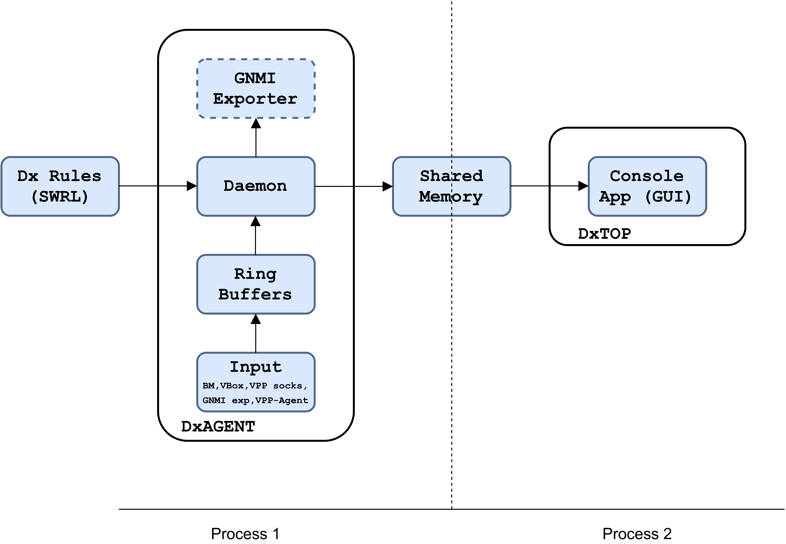

# DxAGENT

Diagnostic Agent

Medical diagnosis (abbreviated Dx or DS) is the process of determining which disease
or condition explains a person's symptoms and signs. It is most often referred to as diagnosis.



## Commands

q or ESC: quit

arrow up, page up: scroll up

arrow down, page down: scroll down

arrow left, arrow right: switch between screens

## Python

- [python] >= 3.8

## Libs

- [python3-ethtool](https://pypi.org/project/ethtool/)
   - Ubuntu: `sudo apt install python3-ethtool`

- [netifaces](https://pypi.org/project/netifaces/)
   - `python3 -m pip install netifaces`

To enable stats add following section to you VPP config:

  ```sh
  statseg {
  	default
  	per-node-counters on
  }
  ```
## Optional Libs

- [pyvbox](https://pypi.org/project/pyvbox/)
   - `python3 -m pip install virtualbox`

- [virtualbox SDK](https://www.virtualbox.org/wiki/Downloads)
   - `python vboxapisetup.py install`

- [VPP Python3 API](https://wiki.fd.io/view/VPP/Python_API)
   - `sudo apt install python3-vpp-api`

## Important files

- `dxagent`, `dxtop`

- `fields.csv` lists all monitored fields

## Author

Korian Edeline

