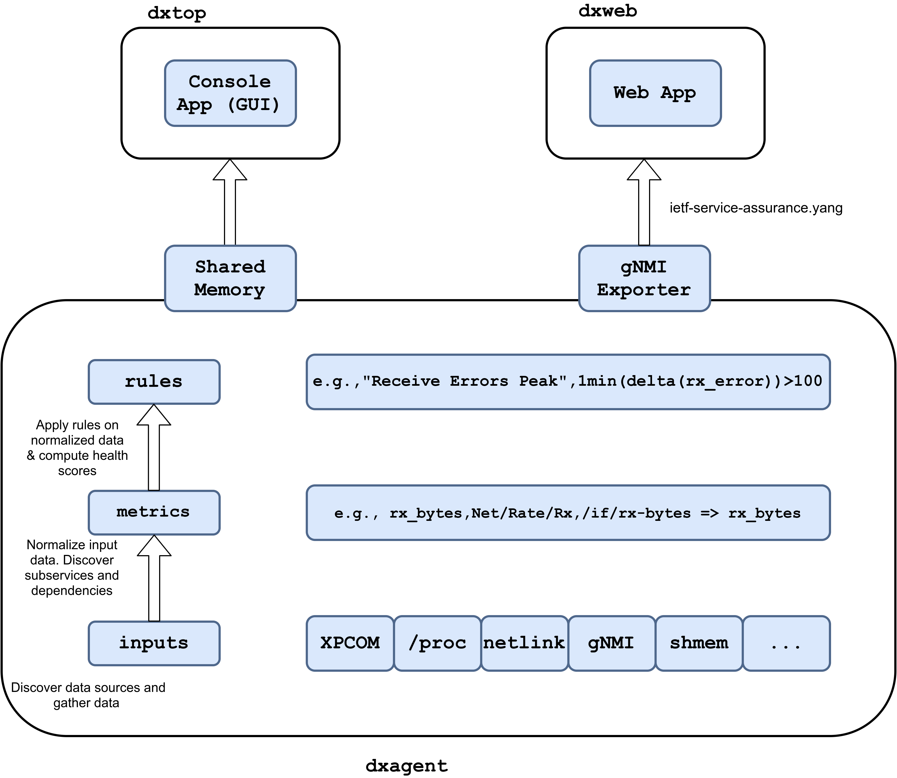
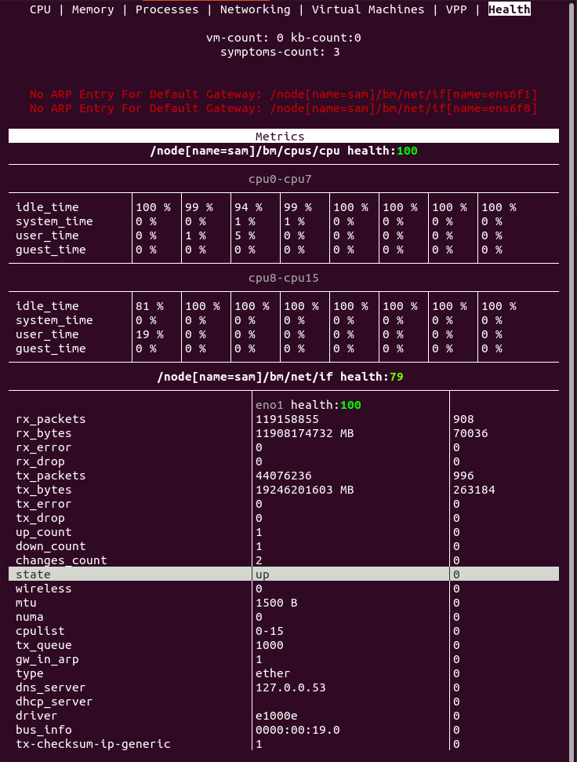
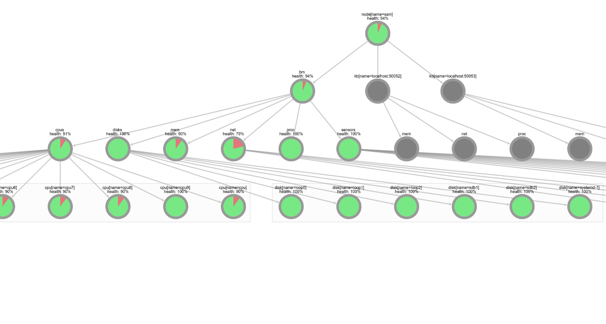

# Diagnostic Agent

## DxAgent

DxAgent is the diagnostic agent daemon. First, it gather baremetal, VM and VPP
data via multiple means. Second, it normalizes collected data and discovers the
active subservices and their dependencies, and build a graph of it. Third, it checks
for symptoms based on user-defined rules applied to normalized metrics,
computes subservices health scores, and propagates health scores along the subservice
dependency graph. 

An optional gNMI exporter can be used to connect multiple instances of dxagent,
or to enable visualization of a node susbervices health scores and dependency
graph via dxweb. gNMI exported data is formatted according to 
[YANG Modules for Service Assurance draft](https://tools.ietf.org/html/draft-claise-opsawg-service-assurance-yang-04).
Locally, shared memory can be used to display similar information in the dxtop
console app.

### DxAgent Commands

* `dxagent [-h] [-l LOG_FILE] [-c CONFIG] [-s] [-v] {start,stop,restart,status}`
   * `LOG_FILE` defaults to `/var/log/dxagent.log`
   * `CONFIG` defaults to `./dxagent.ini`
   * `-s` disables shared memory. Shared memory allows for using DxTop and
     is enabled by default.

### DxAgent Important Files

* `dxagent`
  DxAgent script.

* `dxagent.ini`
  DxAgent configuration file. With a virtualbox hypervisor, `vbox_user`
  *has to* be set.
  
* `input.csv`
   An informative list of vendor-specific monitored fields.

* `metric.csv`
   A list of vendor-independant metrics.

* `rules.csv`
   A list of symptoms.
   
### gNMI exporter

See [agent/gnmi/README.md](https://github.com/ekorian/dxagent/tree/master/agent/gnmi).

## DxTop

DxTop is a console app that displays data collected by DxAgent.

### DxTop Commands

* `dxweb [-h] [-c CONFIG] [-l LOG_FILE] [-t TARGET] [-k CERTS_DIR]`
   * `LOG_FILE` defaults to `/var/log/dxagent.log`
   * `CONFIG` defaults to `./dxagent.ini`
   * `TARGET` defaults to the gnmi target entry in config file. 
      Use the command line argument to specify another target.
   * `CERTS_DIR` certificate/key files location

* q or ESC: **quit**

* arrow up, page up: **scroll up**

* arrow down, page down: **scroll down**

* arrow left, arrow right: **switch between screens**

### DxTop Important Files

* `dxtop`
  DxTop script.
  
## DxWeb

DxWeb is a web interface that display dependency graph, health metrics and
symptoms from DxAgent.

### DxWeb Important Files

* `dxweb`
  DxWeb script.

### DxWeb Libs

- [flask-socketio](https://flask-socketio.readthedocs.io/en/latest/)
   - `python3 -m pip install flask-socketio`

## Requirements

### Owamp Installation guide

- Clone with submodule using, for example :
   - `git clone --recurse-submodules -j8 https://github.com/ekorian/dxagent`
- If Automake is not installed on your machine, do it:
   - `sudo apt-get install -y automake` (on Ubunutu)
- Execute `install_owamp.sh` to configure owamp directories
- (If owamp pings are needed, modify the related attributes in dxagent.ini)

### Python

python >= 3.8 to have dxtop available, otherwise python >= 3.5.

### Libs

- [python3-ethtool](https://pypi.org/project/ethtool/)
   - `sudo apt install python3-ethtool`

- [netifaces](https://pypi.org/project/netifaces/)
   - `python3 -m pip install netifaces`
   
- [pyroute2](https://pypi.org/project/pyroute2/)
   - `python3 -m pip install pyroute2`

- [atomicwrites](https://pypi.org/project/atomicwrites/)
   - `python3 -m pip install atomicwrites`

- [APScheduler](https://pypi.org/project/APScheduler/)
   - `python3 -m pip install APScheduler`

   
### Optional Libs

- [pyvbox](https://pypi.org/project/pyvbox/)
   - `python3 -m pip install virtualbox`

- [virtualbox SDK](https://www.virtualbox.org/wiki/Downloads)
   - `python vboxapisetup.py install`

- [VPP Python3 API](https://wiki.fd.io/view/VPP/Python_API)
   - `sudo apt install python3-vpp-api`

- [cisco-gNMI python](https://pypi.org/project/cisco-gnmi/)
   - `python3 -m pip install cisco-gnmi`
   
### About

Medical diagnosis (abbreviated Dx or DS) is the process of determining which disease
or condition explains a person's symptoms and signs. It is most often referred to as diagnosis.

