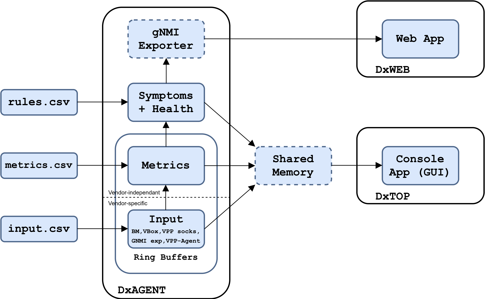

# Diagnostic Agent

Medical diagnosis (abbreviated Dx or DS) is the process of determining which disease
or condition explains a person's symptoms and signs. It is most often referred to as diagnosis.

## DxAgent

DxAgent is the diagnostic agent daemon. It collects baremetal, VM and VPP
diagnostic data, and compute health metrics. It makes it available via an optional GNMI
exporter, and via shared memory for displaying DxTop.

### DxAgent Commands DxTop

* `dxagent [-h] [-l LOG_FILE] [-c CONFIG] [-s] [-v] {start,stop,restart,status}`
   * `LOG_FILE` defaults to `/var/log/dxagent.log`
   * `CONFIG` defaults to `./dxagent.ini`
   * `-s` disables shared memory. Shared memory allows for using DxTop and
     is enabled by default.

### DxAgent Important Files

* `dxagent`
  DxAgent script.

* `dxagent.ini`
  DxAgent configuration file. With a virtualbox hypervisor, `vbox_user`
  *has to* be set.
  
* `input.csv`
   An informative list of vendor-specific monitored fields.

* `metric.csv`
   A list of vendor-independant metrics.

* `rules.csv`
   A list of symptoms.

## DxTop

DxTop is a console app that displays data collected by DxAgent.

### DxTop Commands

* q or ESC: **quit**

* arrow up, page up: **scroll up**

* arrow down, page down: **scroll down**

* arrow left, arrow right: **switch between screens**

### DxTop Important Files

* `dxtop`
  DxTop script.

## Requirements

### Python

- python >= 3.8

### Libs

- [python3-ethtool](https://pypi.org/project/ethtool/)
   - `sudo apt install python3-ethtool`

- [netifaces](https://pypi.org/project/netifaces/)
   - `python3 -m pip install netifaces`

### Optional Libs

- [pyvbox](https://pypi.org/project/pyvbox/)
   - `python3 -m pip install virtualbox`

- [virtualbox SDK](https://www.virtualbox.org/wiki/Downloads)
   - `python vboxapisetup.py install`

- [VPP Python3 API](https://wiki.fd.io/view/VPP/Python_API)
   - `sudo apt install python3-vpp-api`

- [cisco-gNMI python](https://pypi.org/project/cisco-gnmi/)
   - `python3 -m pip install cisco-gnmi`

## Author

Korian Edeline

